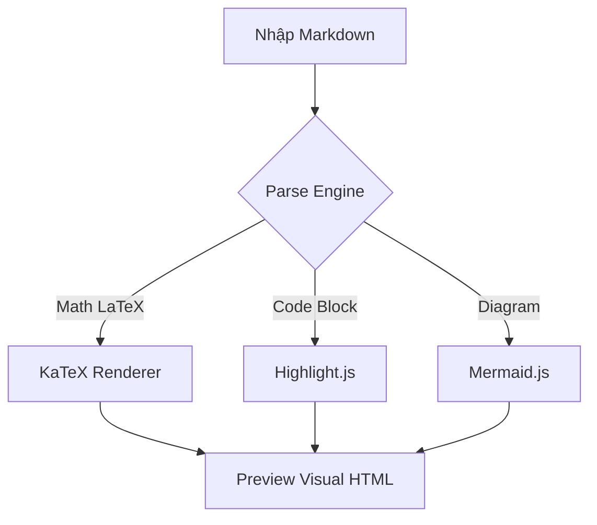

# Welcome to AtMarkdown Reader & Editor 🚀

AtMarkdown là ứng dụng đọc và chỉnh sửa file **Markdown** hiện đại, hỗ trợ công thức Toán LaTeX, Sơ đồ Mermaid, Highlight code và GFM Callouts.

---

## 📐 Công thức Toán học (LaTeX / KaTeX Math)

* **Chỉ số Kỳ vọng (Expectancy)**:
      $$\text{Expectancy} = (\text{Win Rate} \times \text{Average Win R}) - (\text{Loss Rate} \times \text{Average Loss R})$$
* **Chỉ số Yếu tố Lợi nhuận (Profit Factor)**:
      $$\text{Profit Factor} = \frac{\sum \text{Gross Profits (in R)}}{\sum \text{Gross Losses (in R)}}$$

* **Công thức Chuẩn hoá (Inline Math)**: Phương trình $E = mc^2$ và căn bậc hai $\sqrt{x^2 + y^2} = r$.

---

## 💡 GFM Callouts & Alerts

> [!NOTE]
> Ghi chú quan trọng cho tài liệu hoặc hướng dẫn nhanh.

> [!TIP]
> Bấm phím <kbd>Ctrl</kbd> + <kbd>S</kbd> để lưu tài liệu hoặc <kbd>Ctrl</kbd> + <kbd>Shift</kbd> + <kbd>S</kbd> để Save As.

> [!WARNING]
> Cảnh báo trước khi thay đổi cấu hình hoặc xuất dữ liệu!

---

## 📊 Sơ đồ Mermaid (Diagrams)



---

## 🛠️ Code Syntax Highlighting

```python
def calculate_expectancy(win_rate, avg_win_r, loss_rate, avg_loss_r):
    """Tính toán chỉ số Expectancy chuẩn trong Trading"""
    return (win_rate * avg_win_r) - (loss_rate * avg_loss_r)

print("Expectancy:", calculate_expectancy(0.55, 2.0, 0.45, 1.0))
```

```rust
fn greet(name: &str) -> String {
    format!("Hello, {}! Enjoy blazing-fast Markdown editing.", name)
}
```

---

## 📋 Task List & Tables

- [x] Tích hợp KaTeX rendering công thức toán block `$$` và inline `$`
- [x] Hỗ trợ GFM Callouts `[!NOTE]`, `[!TIP]`, `[!WARNING]`
- [x] Tích hợp Highlight.js cho 180+ ngôn ngữ lập trình
- [x] Sơ đồ Mermaid.js tự động thay đổi theo Theme
- [x] Phím bấm `<kbd>` styling

| Feature | Reader View | Split Preview | Export HTML / PDF |
| :--- | :---: | :---: | :---: |
| Math LaTeX | ✅ | ✅ | ✅ |
| Syntax Highlighting | ✅ | ✅ | ✅ |
| Mermaid Diagrams | ✅ | ✅ | ✅ |
| Custom Themes | ✅ | ✅ | ✅ |

---
*Bắt đầu bằng cách bấm nút **📂 Open** trên thanh công cụ hoặc kéo thả file `.md` vào đây!*
